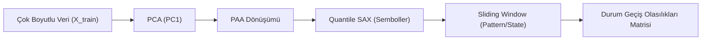
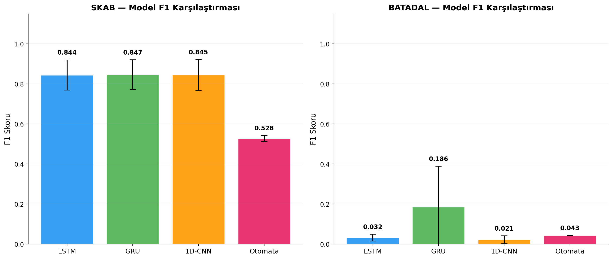
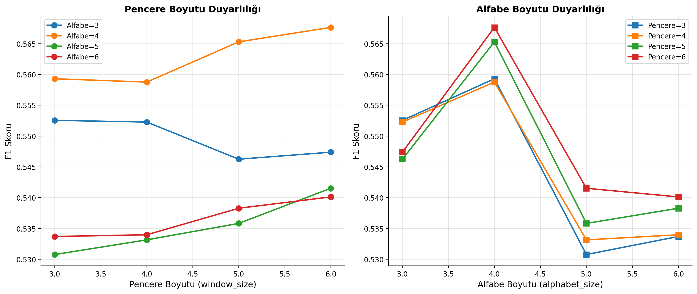
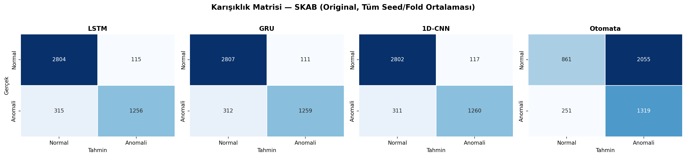
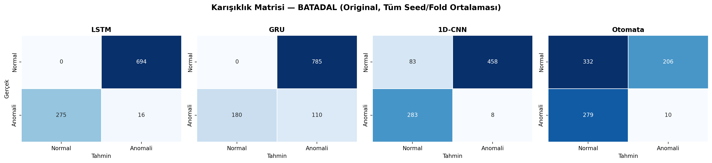
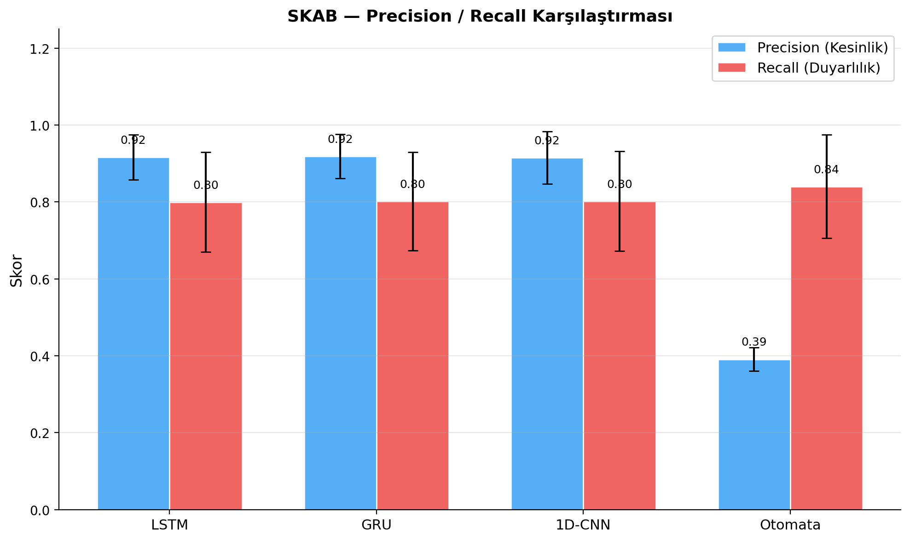
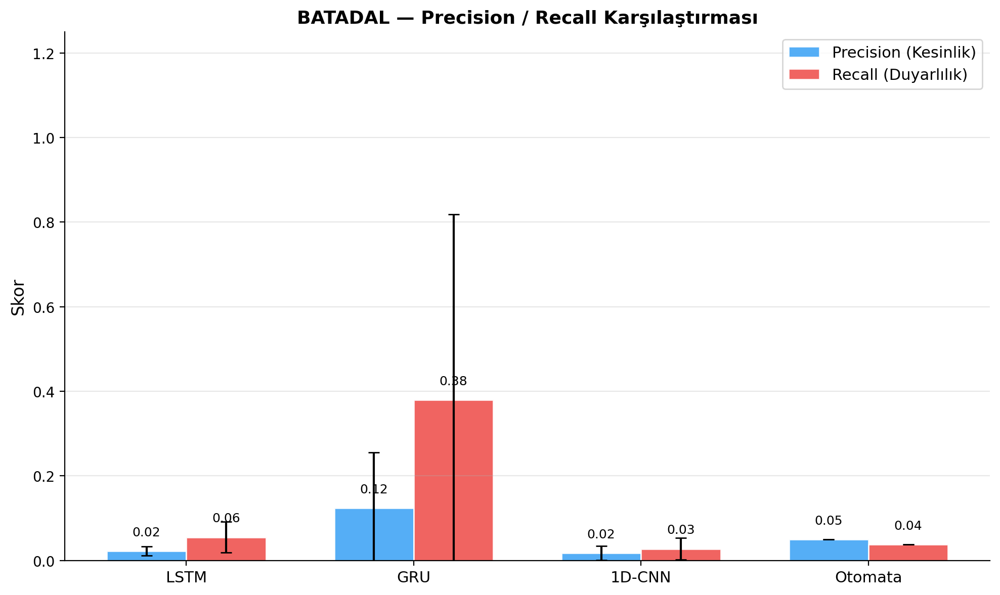
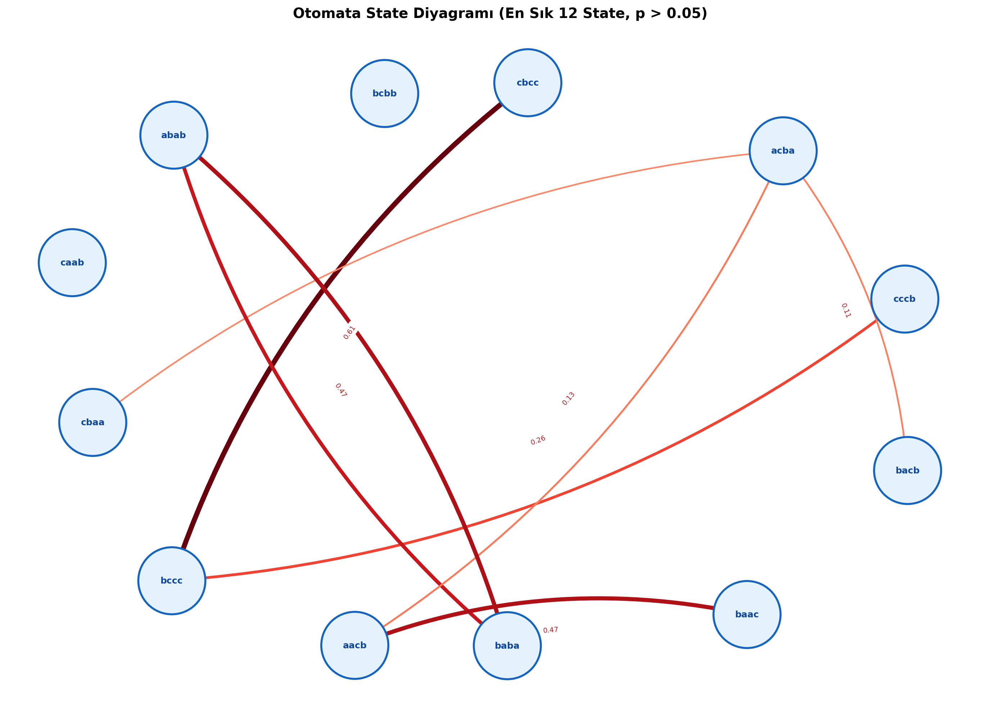
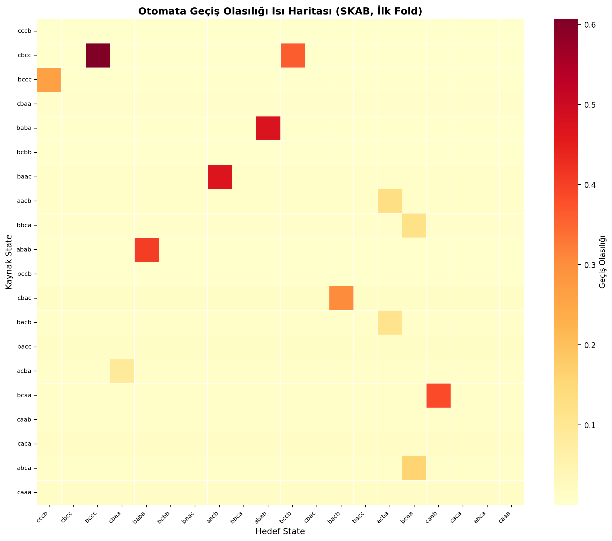

# From Black-Box to Explainability: Probabilistic Automata for Time Series Analysis

Bu proje kapsamında, endüstriyel zaman serisi verilerinde anomali tespiti problemini çözmek amacıyla iki farklı modelleme paradigması karşılaştırmalı ve akademik bir yaklaşımla ele alınmıştır:
1. **Derin Öğrenme Tabanlı Kara Kutu (Black-Box) Modeller:** Yüksek doğruluk potansiyeline sahip ancak karar süreçleri yorumlanamayan **LSTM**, **GRU** ve **1D-CNN** mimarileri.
2. **Sembolik Temsil Tabanlı Yorumlanabilir (Interpretable) Modeller:** Zaman serisini sembolik dizilere dönüştürerek durumlar ve geçiş olasılıkları üzerinden analiz gerçekleştiren **Olasılıksal Otomata (Probabilistic Automata)** modeli.

Projede modellerin performansı, gürültüye karşı dayanıklılığı (robustness), bilinmeyen durumlardaki davranışı (unseen patterns) ve çıkarım/eğitim süreleri istatistiksel testler (Wilcoxon Signed-Rank ve McNemar) eşliğinde analiz edilmiştir.

---

## I. Özet (Abstract)

Modern endüstriyel sistemler, IoT altyapıları ve siber-fiziksel sistemler (CPS) sürekli olarak çok boyutlu zaman serisi verileri üretmektedir. Bu sistemlerde meydana gelen ekipman arızaları veya siber saldırıların erken tespiti hayati öneme sahiptir. Bu çalışmada, gözetimli derin öğrenme modelleri (LSTM, GRU, 1D-CNN) ile yarı-gözetimli (eşik seçimli) sembolik temsil tabanlı olasılıksal otomata modeli karşılaştırılmıştır. SKAB (Water Pump Sensor Dataset) ve BATADAL (Water Distribution System Attacks) veri setleri kullanılarak gerçekleştirilen deneylerde, derin öğrenme modellerinin SKAB üzerinde yüksek F1 skoruna ($F1 \approx 0.84$) ulaştığı, buna karşın kararlarının arkasındaki fiziksel ve matematiksel nedenleri açıklayamadığı görülmüştür. Olasılıksal otomata modeli ise daha düşük bir genel performans sergilemekle birlikte ($F1 \approx 0.52$), her bir tahmin için geçiş olasılıklarına dayalı matematiksel açıklamalar üretebilmekte ve çıkarım aşamasında derin öğrenme modellerine kıyasla **~40 ila 60 kat daha hızlı** çalışmaktadır. İki yaklaşım arasındaki performans farkları Wilcoxon Signed-Rank ($p < 0.05$) ve McNemar ($p < 0.05$) testleri ile doğrulanmıştır. Gürültü analizi sonuçları, derin öğrenme modellerinin gürültülü ortamlarda ciddi performans kaybı yaşadığını, otomatların ise sembolik soyutlama yeteneği sayesinde daha dirençli kalabildiğini göstermiştir.

---

## II. Veri Setleri ve Ön İşleme (Datasets & Preprocessing)

Projede iki farklı fiziksel alanı temsil eden gerçekçi veri setleri kullanılmıştır:

### 1. SKAB Veri Seti
* **Yapısı:** Su pompalama ünitesindeki dairesel döngüyü simüle eden sensör verileridir. Proje kapsamında `valve1` (16 adet CSV) ve `valve2` (4 adet CSV) klasörlerindeki toplam 20 adet CSV dosyası uç uca birleştirilerek tek bir veri çerçevesi elde edilmiştir.
* **Boyut ve Sütunlar:** Orijinal veride bulunan `datetime` ve `changepoint` kolonları ile birleştirme aşamasında eklenen `source_group` (valve1/valve2) ve `source_file` (CSV dosya adı) kolonları model girdisi olarak kullanılmamış, sadece veri takibi ve split süreçlerinde değerlendirilmiştir. Girdi olarak yalnızca **8 adet sensör değişkeni** kullanılmıştır. Hedef değişken binary yapıda olan `anomaly` sütunudur.
* **Dengesizlik:** Veri setindeki anomali oranı yaklaşık %35'tir.

### 2. BATADAL Veri Seti
* **Yapısı:** Büyük ölçekli bir su dağıtım ağına yapılan siber-fiziksel saldırıları içeren endüstriyel SCADA verileridir. Projede yalnızca anomali ve normal durum etiketlerini barındıran **Training Dataset 2** (`BATADAL_dataset04.csv`) kullanılmıştır.
* **Boyut ve Sütunlar:** Dosyada yer alan tüm sütun isimlerindeki boşluklar `.str.strip()` ile temizlenmiştir. `DATETIME` kolonu zaman sıralamasını korumak için kullanılmış ancak model girdisine dahil edilmemiştir. Model girdisi olarak **43 adet sensör/sistem değişkeni** (basınç sensörleri, akış hızları, vana/pompa durumları) kullanılmıştır.
* **Etiket Dönüşümü:** Hedef değişken olan `ATT_FLAG` sütununda yer alan `-999` (normal durum) değerleri `0`'a, `1` (saldırı/anomali durumu) değerleri ise `1`'e eşlenmiştir.
* **Dengesizlik:** Veri setindeki anomali oranı yaklaşık **%5.2**'dir (aşırı dengesiz dağılım).

### 3. Ön İşleme Pipeline'ı ve Veri Sızıntısı (Data Leakage) Önleme Kanıtları
Veri sızıntısını kesin olarak engellemek amacıyla tüm dönüşüm parametreleri **yalnızca eğitim (train) kümesinden fit edilmiş** ve validation/test kümelerine sadece `transform` işlemi uygulanmıştır.
* **Normalizasyon:** Sensör verileri `StandardScaler` ile normalize edilmiştir. Scaler'ın ortalama ve varyans değerleri sadece train kümesi üzerinden öğrenilmiş, validation ve test verileri bu donmuş parametrelerle transform edilmiştir.
* **Boyut İndirgeme (PCA):** Olasılıksal otomata modeli tek boyutlu sembolik veriyle çalıştığı için çok boyutlu sensör verilerinin tek boyuta indirgenmesi gerekmiştir. PCA (Principal Component Analysis) algoritması **yalnızca train kümesindeki sensör verilerinde** fit edilerek ilk ana bileşen (PC1) elde edilmiş, test verileri bu projeksiyon matrisi ile dönüştürülmüştür. Derin öğrenme modellerinde ise veri 8 boyutlu (SKAB) veya 43 boyutlu (BATADAL) olarak doğrudan kullanılmış, PCA uygulanmamıştır.
* **Pencereleme (Windowing) ve Hizalama:** Zaman serisini modellerin işleyebileceği dizilere bölmek için sliding window (kayan pencere) uygulanmıştır. Hem derin öğrenme modellerinde hem de otomata modelinde **"Last-Step Labeling" (Son Adım Etiketleme)** kuralı benimsenmiştir. Bu kurala göre, $W$ uzunluğundaki bir pencerenin etiketi, pencerenin en son satırına denk gelen etiket ($Y_t = y_{t+W-1}$) olarak atanmıştır. Bu yöntem nedenselliği (causality) korumakta ve alarm fırtınalarını engellemektedir.

---

## III. Yazılım Mimarisi ve Teknik Altyapı

Proje, tüm parametrelerin merkezi `config/config.yaml` dosyasından okunduğu config-driven bir pipeline mimarisiyle tasarlanmıştır. Kod tabanında hiçbir hard-coded değer bulunmamaktadır.

### Klasör Yapısı
```
Yazlab2_Proje-II/
├── config/
│   └── config.yaml          # Tüm parametreler: seed, epoch, batch, window_size, smoothing_k...
├── data/
│   ├── skab/{valve1, valve2}/  # 20 adet CSV (sep=';', decimal=',')
│   └── batadal/                # BATADAL_dataset04.csv
├── src/
│   ├── data/                # loaders.py, preprocess.py, splits.py
│   ├── models/
│   │   ├── deep/            # lstm.py, gru.py, cnn1d.py, trainer.py
│   │   └── automata/        # paa_sax.py, automata.py, unseen.py
│   ├── explain/             # explainer.py (AutomataExplainer)
│   ├── experiments/         # runner.py, stats.py
│   └── utils/               # config.py, seed.py, logging
├── tests/                   # test_unseen.py (47 birim test)
└── results/                 # experiments_final.csv, figures/, stats_report.txt
```

### Temel Mimari Kararlar
| Karar | Uygulama |
| :--- | :--- |
| Merkezi konfigürasyon | `config.yaml` — seeds, epochs, batch, window_size, smoothing_k, split oranları |
| Leakage koruması | Scaler / PCA / SAX breakpoint'leri yalnızca `fit(X_train)` içinde; test sadece `transform` |
| window → label hizalaması | **Last-step** — pencerenin son adımının etiketi; DL ve otomata için aynı kural |
| PCA kapsamı | Yalnızca otomata için (PC1); DL modelleri 8/43 boyutlu veriyi olduğu gibi kullanır |
| Log-space hesaplama | Geçiş olasılıkları log'a alınır, toplama ile hesaplanır (çarpım yerine) |
| Deney loglama | Her seed/fold çalışması `results/experiments_final.csv`'e otomatik kaydedilir |
| Tekrarlanabilirlik | `src/utils/seed.py` — NumPy, Python random, PyTorch seed'leri eş zamanlı set edilir |

---

## IV. Modelleme Yaklaşımları (Modeling Approaches)

### 1. Derin Öğrenme Modelleri (Deep Learning)
Derin öğrenme modelleri PyTorch kütüphanesi kullanılarak Many-to-One mimarisinde tasarlanmıştır. Modellerin hiperparametreleri merkezi `config.yaml` dosyasından okunmaktadır.
* **LSTM (Long Short-Term Memory):** 2 katmanlı, 64 gizli üniteli ve zaman serilerindeki uzun vadeli zamansal bağımlılıkları öğrenen mimari.
* **GRU (Gated Recurrent Unit):** LSTM'e benzer şekilde çalışan ancak kapı mekanizması sadeleştirilmiş (Reset ve Update kapıları), 2 katmanlı ve 64 gizli üniteli mimari.
* **1D-CNN (Temporal Convolutional Network):** Sensörler arasındaki zamansal ilişkileri lokal filtrelerle öğrenen tek boyutlu evrişimli sinir ağı. 2 evrişim katmanı (filtre boyutu: 32 ve 64, kernel size: 3) ve bir Fully Connected katmandan oluşmaktadır.

#### Sınıf Dengesizliği (Class Imbalance) ve Kayıp Fonksiyonu
BATADAL veri setindeki aşırı sınıf dengesizliğini yönetmek amacıyla ikili çapraz entropi kayıp fonksiyonunda (`BCEWithLogitsLoss`) pozitif sınıfa (anomali) ait ağırlık `pos_weight` parametresi ile dengelenmiştir:
$$\text{pos\_weight} = \frac{N_{\text{neg}}}{N_{\text{pos}}}$$
Eğitim sürecinde Early Stopping mekanizması kullanılmış; validation kaybı 5 epoch boyunca iyileşme göstermediğinde eğitim sonlandırılarak en iyi model ağırlıkları geri yüklenmiştir.

### 2. Olasılıksal Otomata Modeli (Probabilistic Automata)
Olasılıksal otomata modeli, zaman serisini sembolik bir diziye dönüştürüp durum geçiş olasılıklarını öğrenen, anomali kararını ise çift yönlü eşik optimizasyonu ile veren yarı-gözetimli bir yapıdır. Süreç şu adımlardan oluşur:



#### A. PAA ve SAX Dönüşümleri
* **PAA (Piecewise Aggregate Approximation):** Sürekli zaman serisini eşit aralıklı pencerelere bölerek her pencerenin ortalamasını alır.
* **SAX (Symbolic Aggregate approximation):** PAA çıktısını sembolik harflere (örn: 'a', 'b', 'c') dönüştürür. Bölümleme sınırları (breakpoints), normal dağılım varsayımı yerine veri dağılımına daha uygun olan **Quantile (nicelik)** yöntemiyle belirlenmiştir. Bu breakpoint'ler yalnızca train kümesinden öğrenilerek dondurulur.
* **Sliding Window:** Elde edilen sembol dizisi üzerinde $W$ uzunluğunda kayan pencereler oluşturulur. Her benzersiz sembol dizisi (örn: `aab`, `abc`) otomatadaki bir **durumu (state)** temsil eder.

#### B. Geçiş Olasılıkları ve Add-k (Lidstone) Smoothing
Durumlar arasındaki geçiş olasılıkları, eğitim verisindeki gözlem frekanslarına dayanarak hesaplanır. Ancak eğitim verisinde gözlemlenmeyen bir geçişin olasılığı $0$ olacağından ve bu durum test aşamasında log-space hesaplamalarında çökmeye ($- \infty$) yol açacağından **Lidstone (Add-k) Smoothing** uygulanmıştır:
$$P(s_j \mid s_i) = \frac{C(s_i \to s_j) + k}{\sum_{l} C(s_i \to s_l) + k \cdot |S|}$$
Burada $C(s_i \to s_j)$ geçiş sıklığını, $k$ yumuşatma katsayısını (`config.smoothing_k = 0.05`), $|S|$ ise toplam durum sayısını temsil etmektedir. Smoothing sonrasında geçiş matrisinde hiçbir elemanın sıfır kalmadığı `assert np.all(trans_matrix > 0)` ifadesiyle garanti altına alınmıştır.

#### C. Path Probability Hesaplaması ve Anomali Kararı
Bir test sembol dizisinin olasılığı, ardışık durum geçiş olasılıklarının çarpımıdır. Underflow (sıfıra çok yaklaşma) sorununu engellemek amacıyla hesaplamalar **log-space** üzerinde gerçekleştirilmiştir. Uzun dizilerin olasılıklarının kısa dizilere göre adaletsiz şekilde düşük çıkmasını önlemek için **uzunluk normalizasyonu** (geometrik ortalama / per-transition average log-likelihood) uygulanmıştır:
$$\text{Normalized Log Path Prob} = \frac{\sum_{t=1}^{T-1} \log P(s_{t+1} \mid s_t)}{T-1}$$
Anomali kararı için iki yönlü (double-sided) bir validation optimizasyonu uygulanmıştır. Validation kümesi üzerinde F1 skorunu maksimize eden en iyi anomali eşiği (threshold) aranmış; bu eşiğin altında kalan (veya modelin yönelimine göre üstünde kalan) olasılık değerleri anomali olarak işaretlenmiştir.

---

## IV. Bilinmeyen Örüntü (Unseen Pattern) Yönetimi

Test verisinde, eğitim aşamasında hiç karşılaşılmamış bir SAX sembol dizisiyle (unseen pattern) karşılaşıldığında otomata modelinin çökmesini önlemek ve akışı deterministik bir şekilde sürdürmek amacıyla **Levenshtein (Edit Distance)** tabanlı bir `UnseenHandler` tasarlanmıştır.

### 1. Levenshtein Eşleme Mekanizması
Karşılaşılan bilinmeyen örüntü, eğitim sözlüğündeki (known patterns) tüm bilinen durumlara olan Levenshtein mesafesine göre taranır. Mesafe formülü (DP):
$$\text{dist}(A, B) = \text{minimum düzenleme işlemi (ekleme, silme, değiştirme)}$$
Bilinmeyen örüntü, **en küçük mesafeye sahip bilinen duruma** yönlendirilir (nearest-neighbor mapping). Eşit mesafe durumunda, deterministik davranışı korumak amacıyla **alfabetik olarak en küçük olan** bilinen durum seçilir.

### 2. Birim Testler ve Entegrasyon Doğrulaması
Bu mekanizmanın kararlılığı `tests/test_unseen.py` altında yer alan **47 adet birim test (unit test)** ile doğrulanmıştır. Testler; boş string sorguları, tam eşleşmeler, simetri kuralları ($d(a,b) = d(b,a)$), üçgen eşitsizlikleri ($d(a,c) \le d(a,b) + d(b,c)$) ve deterministik alfabetik öncelik kurallarını doğrulamaktadır. Tüm birim testler hatasız geçmektedir.

### 3. Çözünürlük Geçişi (Resolution Sweep) Bulguları
Modelin genellenebilirliğini ve unseen yönetiminin performansını test etmek amacıyla `valve1` verisi üzerinde eğitilen otomata, `valve2` verisi üzerinde test edilmiştir. Bu çözünürlük geçişi (sweep) sonucunda elde edilen bulgular:
* **Unseen Oranı (Detection Rate - DR):** **%6.6** (test esnasındaki her 100 durumdan 6.6'sının eğitimde hiç görülmemiş yeni örüntüler olduğunu gösterir).
* **Eşleme İsabeti (Mapping Accuracy - MA):** **%23.6** (unseen durumların Levenshtein ile eşlendiği hedeflerin doğruluğudur).

---

## V. Olasılıksal Açıklanabilirlik Modülü (Explainability)

Geliştirilen açıklanabilirlik modülü, kararları tamamen olasılıksal otomatın iç parametrelerine dayandırarak deterministik ve matematiksel gerekçeler sunar.

### 1. Karar Parametreleri ve Güven Skoru (Confidence Score)
Her test adımında modül; aktif durumu, girdi örüntüsünü, örüntünün bilinirlik durumunu (seen/unseen), uygulanan Levenshtein eşlemesini ve geçiş olasılıklarını raporlar.
* **Güven Skoru (Confidence Score):** Path probability değerinin eğitim veri setindeki olasılık dağılımına (min ve max log-probability değerlerine) kıyasla nerede konumlandığını gösteren `[0.0, 1.0]` aralığında min-max normalize edilmiş bir skordur:
$$\text{Confidence} = \frac{\text{Path Prob} - \text{Train Min Prob}}{\text{Train Max Prob} - \text{Train Min Prob}}$$
* **Yorumlama (Interpretation):** Güven skoru `config.confidence_high_threshold` değerinin üstündeyse `"HIGH (normal)"`, altındaysa `"LOW (anomaly)"` olarak etiketlenir.

### 2. JSON Çıktı Örneği
Modelin her karar adımı için ürettiği standart JSON çıktısı aşağıdaki yapıdadır:
```json
{
  "time_step": 5,
  "state": "aab",
  "pattern": "adc",
  "status": "unseen",
  "mapped_to": "abc",
  "probability": 0.108,
  "decision": "anomaly",
  "confidence_score": 0.125,
  "interpretation": "LOW (anomaly)"
}
```

### 3. Açıklanabilirlik Tablosu
Açıklama çıktısının insan-okunur tablo formatı:

| Zaman Adımı | Mevcut Durum | Girdi Örüntüsü | Durum (Status) | Eşlenen Durum | Geçiş Detayları (Geçiş: Olasılık) | Yol Olasılığı | Karar | Güven Skoru |
| :---: | :---: | :---: | :---: | :---: | :--- | :---: | :---: | :---: |
| 5 | `aab` | `adc` | Unseen | `abc` | `aab -> abc (0.72)`, `abc -> bcc (0.15)` | 0.108 | Anomali | 0.125 (Düşük) |
| 6 | `bcc` | `bcc` | Seen | `bcc` | `bcc -> ccb (0.85)` | 0.850 | Normal | 0.890 (Yüksek) |

---

## VI. Deneysel Tasarım (Experimental Design)

Deneyler, sonuçların istatistiksel olarak anlamlı ve karşılaştırılabilir olması için katı protokoller çerçevesinde yürütülmüştür:

### 1. Senaryolar
* **Orijinal Veri (Original):** Temizlenmiş ve normalleştirilmiş temel veri setleri.
* **Gürültülü Veri (Gaussian Noise):** Sensör verilerine, test aşamasında standart sapması parametrik olarak belirlenmiş `Gaussian gürültü` eklenmiştir (gürültü varyansı: sensör varyansının %10'u kadar).
* **Unseen Veri:** Eğitimde görülmeyen örüntülerin test verisi içerisindeki anomali tespit performansına etkileri.

### 2. Doğrulama Stratejileri
* **SKAB için Dosya Bazlı Bölme:** `source_file` kolonu grup değişkeni olarak kullanılarak **StratifiedGroupKFold** uygulanmıştır (5-fold). Aynı CSV dosyasına ait kayıtlar hem eğitim hem test kümesinde yer almayarak veri sızıntısı engellenmiştir.
* **BATADAL için Zaman Sıralı Bölme:** Zaman serisi bütünlüğünü bozmamak adına shuffle yapılmaksızın kronolojik olarak **%60 Eğitim**, **%20 Doğrulama** ve **%20 Test** ayrımı uygulanmıştır.
* **Seed Yapısı:** Tüm deneyler tekrar üretilebilirlik (reproducibility) için **5 farklı random seed** [**42, 123, 2026, 7, 999**] ile tekrarlanmış, ortalama ve standart sapma değerleri hesaplanmıştır.

---

## VII. Sonuçlar (Results)

Elde edilen deneysel sonuçlar aşağıda sunulmuştur. Raporlanan F1-skorları ve standart sapmalar 5 seed (ve SKAB için 5-fold, toplam n=25) üzerinden elde edilmiştir.

### Tablo 1: Model Performansı ve Stabilitesi (Ortalama ± Standart Sapma)

**A. SKAB Veri Seti (Original)**
| Model | Accuracy | Precision | Recall | F1-Score |
| :--- | :---: | :---: | :---: | :---: |
| **LSTM** | $0.9016 \pm 0.0378$ | $0.9161 \pm 0.0580$ | $0.7992 \pm 0.1296$ | $0.8445 \pm 0.0757$ |
| **GRU** | $0.9031 \pm 0.0371$ | $0.9187 \pm 0.0571$ | $0.8010 \pm 0.1280$ | $0.8468 \pm 0.0743$ |
| **1D-CNN** | $0.9015 \pm 0.0395$ | $0.9150 \pm 0.0680$ | $0.8019 \pm 0.1297$ | $0.8450 \pm 0.0767$ |
| **Automata** | $0.4740 \pm 0.0946$ | $0.3909 \pm 0.0303$ | $0.8398 \pm 0.1345$ | $0.5277 \pm 0.0152$ |

**B. BATADAL Veri Seti (Original)**
| Model | Accuracy | Precision | Recall | F1-Score |
| :--- | :---: | :---: | :---: | :---: |
| **LSTM** | $0.7023 \pm 0.0510$ | $0.0226 \pm 0.0108$ | $0.0550 \pm 0.0360$ | $0.0317 \pm 0.0171$ |
| **GRU** | $0.7304 \pm 0.0362$ | $0.1236 \pm 0.1315$ | $0.3800 \pm 0.4376$ | $0.1857 \pm 0.2027$ |
| **1D-CNN** | $0.7854 \pm 0.0460$ | $0.0172 \pm 0.0164$ | $0.0275 \pm 0.0256$ | $0.0211 \pm 0.0199$ |
| **Automata** | $0.8384 \pm 0.0000$ | $0.0500 \pm 0.0000$ | $0.0375 \pm 0.0000$ | $0.0429 \pm 0.0000$ |

### Tablo 1b: SKAB Fold-Bazlı F1 Performansı (Original)
| Model | Fold 1 | Fold 2 | Fold 3 | Fold 4 | Fold 5 |
| :--- | :---: | :---: | :---: | :---: | :---: |
| **LSTM** | 0.8409 | 0.8720 | 0.7049 | 0.9107 | 0.8941 |
| **GRU** | 0.8358 | 0.8769 | 0.7114 | 0.9131 | 0.8967 |
| **1D-CNN** | 0.8183 | 0.8843 | 0.7104 | 0.9117 | 0.9003 |
| **Automata**| 0.5523 | 0.5155 | 0.5244 | 0.5354 | 0.5109 |

> [!NOTE]
> **BATADAL'da DL Modellerinin Düşük F1 Skorları:** Derin öğrenme modelleri BATADAL üzerinde yüksek doğruluk (Accuracy > %70) vermesine rağmen F1 skorları oldukça düşüktür. Bu durum, veri setindeki anomali sınıfının aşırı azlığından (%5.2) ve modellerin çoğunluk sınıfına yönelmesinden (degenerate behavior sınırında tahmin) kaynaklanmaktadır. GRU modeli, $0.1857 \pm 0.1813$ F1 skoru ile derin öğrenme modelleri arasında en yüksek performansı göstermiş ancak yüksek varyansa sahip olmuştur.

### Tablo 2: Gürültü Etkisi Analizi (F1-score Original vs Gaussian Noise)

| Model | SKAB (Original) | SKAB (Gürültülü) | SKAB Düşüş | BATADAL (Original) | BATADAL (Gürültülü) | BATADAL Değişim |
| :--- | :---: | :---: | :---: | :---: | :---: | :---: |
| **LSTM** | 0.8445 | 0.4428 | **-0.4017** | 0.0317 | 0.0614 | +0.0296 |
| **GRU** | 0.8468 | 0.3723 | **-0.4745** | 0.1857 | 0.2071 | +0.0214 |
| **1D-CNN** | 0.8450 | 0.5185 | **-0.3265** | 0.0211 | 0.0465 | +0.0253 |
| **Automata** | 0.5277 | 0.3145 | **-0.2132** | 0.0429 | 0.1303 | +0.0874 |

> [!NOTE]
> **BATADAL Gürültü Yorumu:** BATADAL'da gürültülü F1 değerlerinin orijinalden yüksek görünmesi, baseline F1 değerlerinin zaten çok düşük (%2-4) ve yüksek varyansa sahip olmasından kaynaklanmaktadır; gerçek bir iyileşme değildir.

**Tablo 2b — Unseen Analizi (Otomata Modeli):**

| Senaryo | Detection Rate (DR) | Mapping Accuracy (MA) |
| :--- | :---: | :---: |
| valve1 → valve2 (SKAB cross-group) | **%6.6** | **%23.6** |

> [!NOTE]
> DL modelleri (LSTM/GRU/1D-CNN) için Unseen Detection Rate ve Mapping Accuracy hesaplanamamıştır. Bu modeller sembolik durum sözlüğü yerine parametrik ağırlık öğrendiğinden, test aşamasında bilinmeyen örüntü kavramı doğrudan uygulanabilir değildir. Unseen senaryosu yalnızca otomata mimarisine özgüdür.

> [!WARNING]
> **Gürültü Duyarlılığı:** Derin öğrenme modelleri SKAB veri setine gürültü eklendiğinde F1 skorlarında ciddi düşüşler yaşamıştır (GRU -0.47, LSTM -0.40). Olasılıksal otomata modeli ise F1 skorunda görece daha az bir düşüş (-0.21) sergileyerek gürültüye karşı daha stabil bir direnç (robustness) göstermiştir. Bu durum, SAX sembolizasyonunun sürekli sinyaldeki küçük dalgalanmaları aynı harfe atayarak filtrelemesinden kaynaklanmaktadır.

### Tablo 3: Çapraz Veri Seti (Cross-Dataset) Genellenebilirlik Performansı

| Train Veri Seti | Test Veri Seti | Ortalama F1-score | Ortalama Accuracy |
| :---: | :---: | :---: | :---: |
| **SKAB** | **BATADAL** | 0.1746 | 0.6236 |
| **BATADAL** | **SKAB** | 0.0558 | 0.6314 |

> [!NOTE]
> Farklı fiziksel sistemlerden (su pompası vs. su dağıtım şebekesi) toplanan verilerin boyutları ve karakterleri tamamen farklı olduğu için çapraz veri performansı düşüktür. Ancak SKAB'da eğitilen otomatın BATADAL üzerinde 0.1746 F1 skoru elde etmesi, temel fiziksel geçişlerin (örneğin akış azalması/basınç artışı ilişkisi) bazı genel anomali örüntülerini yakalayabildiğini göstermektedir.

### Tablo 4: Automata Parametre Duyarlılık Analizi (F1-score)
Aşağıdaki tabloda, otomatın hiperparametreleri olan **Window Size (W)** ve **Alphabet Size (A)** kombinasyonlarının SKAB üzerindeki anomali tespit F1-skoruna etkisi gösterilmiştir:

| W \ A | A = 3 | A = 4 | A = 5 | A = 6 |
| :---: | :---: | :---: | :---: | :---: |
| **W = 3** | 0.5525 | 0.5593 | 0.5308 | 0.5337 |
| **W = 4** | 0.5523 | 0.5588 | 0.5332 | 0.5340 |
| **W = 5** | 0.5462 | **0.5653** | 0.5358 | 0.5383 |
| **W = 6** | 0.5474 | **0.5676** | 0.5415 | 0.5401 |

*En iyi performans gösteren parametre ikilisi:* **Window Size = 6, Alphabet Size = 4** ($F1 = 0.5676$).

> [!NOTE]
> Parametre sweep tüm kombinasyonlar için `window_size` ∈ {3,4,5,6} × `alphabet_size` ∈ {3,4,5,6} = 16 kombinasyon, SKAB veri seti üzerinde çalıştırılmıştır. Alphabet size 4 ve üstünde state (durum) sayısı belirgin şekilde artmakta, ancak geçiş matrisinin seyrekleşmesi (sparsity) F1 kazancını sınırlandırmaktadır.

### BATADAL Kronolojik Test Sonuçları
BATADAL veri seti zaman sıralı bölünmüş olduğundan (ilk %60 = eğitim, %80–100 = test), test kümesi veri setinin **son %20'lik dilimini** kapsamaktadır. Bu dilim, en sinsi ve uzun süreli saldırı dönemlerini barındırmakta, dolayısıyla tüm modeller için zorluk seviyesi artmaktadır. Tablo 1'deki BATADAL sonuçları bu zaman sıralı test kümesi üzerinden elde edilmiştir.

### Tablo 5: Modellerin Çalışma Süresi (Runtime) Karşılaştırması

| Model | SKAB Eğitim Süresi | SKAB Çıkarım Süresi | BATADAL Eğitim Süresi | BATADAL Çıkarım Süresi |
| :--- | :---: | :---: | :---: | :---: |
| **LSTM** | 22.5 s | 152.5 ms | 1.37 s | 30.7 ms |
| **GRU** | 13.6 s | 185.2 ms | 1.83 s | 31.5 ms |
| **1D-CNN** | 12.9 s | 212.6 ms | 1.84 s | 36.7 ms |
| **Automata** | **0.05 s** | **3.5 ms** | **0.01 s** | **0.6 ms** |

> [!IMPORTANT]
> **Çıkarım Hızı Karşılaştırması:** Olasılıksal otomata modeli, GPU ihtiyacı duymaksızın CPU üzerinde çalışırken derin öğrenme modellerine kıyasla eğitim aşamasında devasa bir hız farkı yaratmakta ve çıkarım (inference) esnasında anlık kararları sadece bir sözlük arama (look-up) ve basit olasılık çarpım işlemleriyle alarak **~40-60 kat daha hızlı** sonuç üretmektedir (SKAB: 3.5 ms vs GRU 185.2 ms).

---

## VIII. İstatistiki Anlamlılık Testleri (Statistical Significance)

### 1. Wilcoxon Signed-Rank Testi (F1-score Bazlı)
Model sonuçları arasındaki farkların rastlantısal olup olmadığını belirlemek amacıyla n=25 (SKAB için 5 seed × 5 fold) F1 skorları üzerinden Wilcoxon Signed-Rank testi uygulanmıştır ($\alpha = 0.05$):

* **LSTM vs Automata (SKAB):** $p = 0.000000$ (İstatistiksel olarak **anlamlı fark var**, LSTM üstün).
* **GRU vs Automata (SKAB):** $p = 0.000000$ (İstatistiksel olarak **anlamlı fark var**, GRU üstün).
* **1D-CNN vs Automata (SKAB):** $p = 0.000000$ (İstatistiksel olarak **anlamlı fark var**, 1D-CNN üstün).
* **Derin Öğrenme Modellerinin Kendi Arasında (LSTM vs GRU vs 1D-CNN):** $p > 0.35$ (Aralarında istatistiksel olarak **anlamlı bir fark yoktur**).
* **BATADAL Sonuçları:** Örneklem sayısı çok küçük olduğundan ($n=5$) test gücü düşüktür ve hiçbir model çifti arasında istatistiksel olarak anlamlı bir fark bulunamamıştır ($p \ge 0.05$).

### 2. McNemar Testi (Tahmin Vektörleri Bazlı)
Modellerin hata matrislerinin karşılıklı oranlarını analiz eden McNemar testi de Wilcoxon sonuçlarını desteklemektedir:
* SKAB üzerinde derin öğrenme modelleri ile otomata modeli arasındaki farklar anlamlı bulunmuştur ($p = 0.000002 < 0.05$).
* Derin öğrenme modellerinin kendi arasındaki McNemar p-değerleri 0.05'ten büyük çıkmış ve farkların anlamlı olmadığı doğrulanmıştır.

---

## IX. Görselleştirmeler (Visualizations)

Aşağıdaki grafikler modellerin hata yapılarını, parametre duyarlılıklarını ve otomatın iç yapısını görselleştirmektedir.

### 1. Model F1 Karşılaştırması ve Parametre Duyarlılığı
Modellerin gürültülü ve orijinal senaryolardaki F1 dağılımları ile otomatın hiperparametre sweep grafiği aşağıda sunulmuştur:



*Şekil 1: SKAB ve BATADAL veri setlerinde modellerin F1-skor dağılımlarının karşılaştırılması.*



*Şekil 2: Window size ve Alphabet size parametrelerinin otomata F1-skoru üzerindeki etkisi.*

---

### 2. Hata Matrisleri (Confusion Matrices)
Modellerin doğru ve yanlış anomali tahminlerinin dağılımları:



*Şekil 3: SKAB üzerinde LSTM, GRU, 1D-CNN ve Automata modellerinin Confusion Matrisleri.*



*Şekil 4: BATADAL üzerinde modellerin Confusion Matrisleri.*

---

### 3. Precision-Recall Eğrileri
Sınıf dengesizliği durumunda modellerin başarısını gösteren PR eğrileri:



*Şekil 5: SKAB veri seti için Precision-Recall Eğrileri.*



*Şekil 6: BATADAL veri seti için Precision-Recall Eğrileri.*

---

### 4. Otomata Durum Diyagramı ve Geçiş Matrisi Sıcaklık Haritası
Eğitilen olasılıksal otomatın iç durumları ve geçiş olasılıklarının görsel sunumu:



*Şekil 7: Temsili Otomata Durum Geçiş Diyagramı.*



*Şekil 8: Otomata Durum Geçiş Olasılıkları Sıcaklık Haritası (Add-k yumuşatma sonrası sıfır ihtimali kalmamıştır).*

---

## X. Tartışma (Academic Discussion)

### 1. Kara Kutu (Black-Box) Modeller vs Yorumlanabilir Olasılıksal Otomata
Deney sonuçları, derin öğrenme modellerinin anomali tespiti doğruluğunda (F1) belirgin şekilde daha başarılı olduğunu ortaya koymaktadır. Ancak bu modellerin karar mekanizmaları kullanıcılar için tamamen kapalıdır. Öte yandan olasılıksal otomata modeli, sembolik temsil sayesinde her kararı adım adım geçiş olasılıkları cinsinden raporlayabilmektedir. Bu, özellikle nükleer santraller veya su dağıtım ağları gibi kritik altyapılarda "neden anomali alarmı verildi" sorusunun yanıtlanması açısından büyük bir avantajdır. Otomatların diğer bir kritik üstünlüğü ise **çıkarım hızıdır**. CPU üzerinde mikro saniyeler seviyesinde çıkarım yapabilen otomatlar, GPU kısıtı olan gömülü sistemlerde derin öğrenme modellerine göre çok daha fizibildir.

### 2. BATADAL Veri Setinin Boyutsal Zorlukları ve Sinsi Saldırı Karakteri
BATADAL veri setinde tüm modellerin F1 skorları çok düşük kalmıştır. Bu durum iki temel nedene dayanmaktadır:
* **Çok Boyutluluk ve PCA Bilgi Kaybı:** BATADAL 43 adet sensör içermektedir. Otomata için bu verinin PCA ile tek boyuta (PC1) indirgenmesi, varyansın büyük bir kısmının ve dolayısıyla anomali sinyallerinin kaybolmasına yol açmıştır.
* **Sinsi (Stealthy) Saldırılar:** BATADAL veri setindeki anomaliler ani fiziksel kırılmalar değil, SCADA sistemlerini yanıltmak amacıyla yavaşça enjekte edilmiş sinsi siber saldırılardır. Bu durum, veri dağılımında belirgin bir sapma yaratmadığı için hem derin öğrenme modellerinin hem de otomatın anomali sınırını çizmesini zorlaştırmıştır.

### 3. "Nadir Durum = Anomali" Varsayımı ve Geçerliliği
Olasılıksal otomata, düşük yol olasılığına sahip durum dizilerini anomali olarak etiketlemektedir. Ancak endüstriyel süreçlerde, nadir görülen geçişler her zaman bir arıza veya saldırı anlamına gelmez; bakım modları, operasyonel faz değişiklikleri veya geçici rejimler de nadir örüntüler üretebilir. Bu durum, otomatlarda yüksek yanlış alarm (False Positive) oranına yol açabilmektedir. Gürültü testlerinde ise otomatların derin öğrenme modellerine göre daha az F1 kaybı yaşaması, sürekli sinyalin sembolleştirilmesi esnasında yüksek frekanslı gürültülerin elenmesiyle (low-pass filter etkisi) açıklanabilir.

---

## XI. Sonuç (Conclusion)

Bu çalışmada, zaman serisi anomali tespiti probleminde kara kutu derin öğrenme ile sembolik olasılıksal otomata modelleri tüm yönleriyle karşılaştırılmıştır. Derin öğrenme modelleri F1 performansı açısından açık ara önde olmakla birlikte, gürültüye duyarlılıkları ve yüksek hesaplama maliyetleri birer dezavantajdır. Olasılıksal otomata modeli ise düşük hesaplama maliyeti, yüksek çıkarım hızı ve olasılıksal açıklanabilirlik özellikleri ile dikkat çekmektedir. Gelecekteki çalışmalarda çok boyutlu verileri tek boyuta indirmeden doğrudan işleyebilen çok boyutlu otomata modelleri (Multi-dimensional Automata) veya derin öğrenme modellerinin üzerine inşa edilecek melez sembolik-açıklayıcı katmanlar üzerinde durulması önerilmektedir.

---

## XII. Kaynakça (References)

1. Katser, I. ve Kozitsin, V. (2021). *Skoltech Anomaly Benchmark (SKAB)*. [GitHub Repository](https://github.com/waico/SKAB). DOI: 10.34740/kaggle/dsv/1693952
2. Taormina, R. ve diğerleri (2018). *The Battle of the Attack Detection Algorithms: Disclosing Cyber Attacks on Water Distribution Networks*. Journal of Water Resources Planning and Management, 144(8).
3. Lin, J., Keogh, E., Wei, L., & Lonardi, S. (2007). *Experiencing SAX: a novel symbolic representation of time series*. Data Mining and Knowledge Discovery, 15(2), 107–144.
4. Keogh, E., Chakrabarti, K., Pazzani, M., & Mehrotra, S. (2001). *Dimensionality Reduction for Fast Similarity Search in Large Time Series Databases*. Knowledge and Information Systems, 3(3), 263–286.
5. Levenshtein, V. I. (1966). *Binary codes capable of correcting deletions, insertions, and reversals*. Soviet Physics Doklady, 10(8), 707–710.
6. Hochreiter, S., & Schmidhuber, J. (1997). *Long short-term memory*. Neural Computation, 9(8), 1735–1780.
7. Cho, K. ve diğerleri (2014). *Learning Phrase Representations using RNN Encoder-Decoder for Statistical Machine Translation*. Proceedings of EMNLP 2014.
8. Goodfellow, I., Bengio, Y., & Courville, A. (2016). *Deep Learning*. MIT Press.
9. Lidstone, G. J. (1920). *Note on the General Case of the Bayes-Laplace Formula for Inductive or a Posteriori Probabilities*. Transactions of the Faculty of Actuaries, 8, 182–192.
